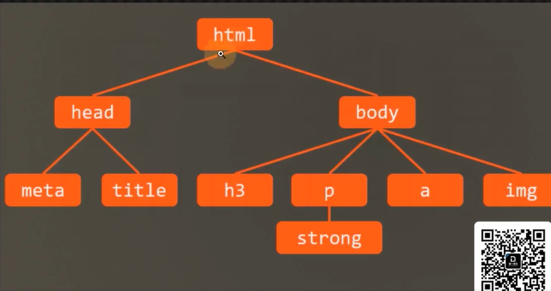

# 属性值的计算过程

一个元素一个元素依次渲染，顺序按照页面文档的树形目录结构进行

渲染每个元素的前提条件：该元素的所有CSS属性必须有值

一个元素，从所有属性都没有值到所有属性都有值，这个计算过程叫做属性值计算过程。
    1. 确认声明值：参考样式表中没有冲突的声明，作为CSS属性值。
    2. 层叠冲突：对样式表有冲突的声明使用层叠规则，确认CSS属性值。
    3. 使用继承： 对仍然没有值的属性，若可以继承，则继承父元素的值。
    4. 使用默认值：对仍然没有值的属性，使用默认值。

特殊的两个CSS取值：

    -inherit:手动（强制）继承，将父元素的值取出应用到该元素。
    -initial:初始值，将该属性设置为默认值